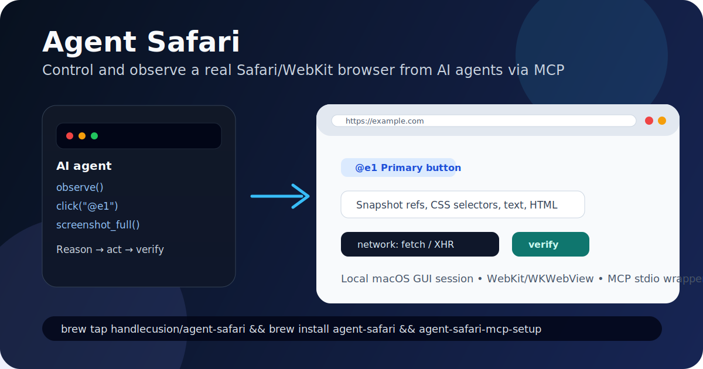

# agent-safari

Control and observe a real Safari/WebKit browser from AI agents via MCP.

`agent-safari` is a local-first macOS browser automation CLI, native WebKit window, local daemon, and MCP stdio server. It gives Claude, Hermes, Codex-style agents, and other MCP clients the browser tools they need for an observe → act → verify loop: compact snapshot refs, clicks/fills, screenshots, JavaScript evaluation, tabs, waits, and fetch/XHR network capture.



```text
AI agent -> MCP wrapper -> agent-safari CLI -> local daemon -> real WKWebView window
          observe/status -> snapshot @e refs -> click/fill -> wait -> screenshot/evaluate/network inspect
```

If this is useful for your agentic browser workflows, a GitHub star helps the project reach more builders.

## Why Agent Safari?

Most browser automation tools are built for deterministic test scripts. Agent Safari is built for AI agents that need to inspect a rendered page, choose an action, act through a simple tool interface, then verify the result.

Use it when you want to:

- Drive a local Safari/WebKit session from an MCP-capable agent.
- Test how a web app behaves in WebKit, not just Chromium.
- Give an agent clickable snapshot refs such as `@e1` instead of forcing it to invent selectors.
- Capture screenshots and fetch/XHR activity as verification evidence.
- Keep the browser local and human-observable instead of using a hosted browser service.

## Highlights

- Native macOS WebKit/WKWebView browser window; no Chrome, Playwright, or remote browser service required.
- Visible browser chrome with editable address bar for human-observable automation.
- CLI-first control surface with one JSON response line per command.
- MCP wrapper for Hermes, Claude Desktop, Cursor, Windsurf, VS Code, and other MCP-compatible clients.
- Agent-friendly refs from `snapshot`, e.g. `@e1`, reusable by `click` and `fill`.
- Viewport, full-page, and element screenshots.
- JavaScript `evaluate`, text/HTML extraction, wait helpers, history, modeled tabs, profiles, and ephemeral mode.
- Local fetch/XHR network capture instrumentation with redacted JSON export.

## How it compares

| Capability | Agent Safari | Playwright | Generic browser MCP servers |
| --- | --- | --- | --- |
| Primary design target | AI-agent observe/act/verify loops | Test automation | Varies |
| Native Safari/WebKit GUI | Yes, WKWebView on macOS | WebKit automation, test-first | Rare/mixed |
| MCP-native control surface | Yes | No | Yes |
| Snapshot refs for agent actions | Yes, `@e1` style refs | No | Mixed |
| CLI JSON responses | Yes | No | Mixed |
| Screenshots | Viewport, full page, element | Yes | Mixed |
| Network capture | fetch/XHR instrumentation | Browser automation APIs | Mixed |
| Local human-observable window | Yes | Usually test runner oriented | Mixed |

## Requirements

- macOS with a logged-in GUI session.
- Swift toolchain when building from source or installing via Homebrew.
- Python 3 when using the MCP wrapper.
- Optional: macOS Accessibility permission for strict/native click verification.

Headless SSH-only sessions are not enough because the daemon owns a real WebKit window.

## Install

### Homebrew, recommended for most macOS users

```sh
brew tap handlecusion/agent-safari
brew install agent-safari
```

This installs the native CLI and the MCP wrapper files from the public Homebrew tap:

- https://github.com/handlecusion/homebrew-agent-safari

To connect the installed MCP wrapper to local AI agents, run the consent-first setup helper:

```sh
agent-safari-mcp-setup
```

It detects Claude Desktop, Cursor, Windsurf, VS Code, and Hermes Agent config locations, shows the MCP config it will add, and asks before writing each file. For a preview only:

```sh
agent-safari-mcp-setup --dry-run
```

### GitHub Release binary

Download the latest macOS ARM64 release zip, unpack it, and run the included installer:

```sh
curl -L -o /tmp/agent-safari-v0.0.5-macOS-ARM64.zip \
  https://github.com/handlecusion/agent-safari/releases/download/v0.0.5/agent-safari-v0.0.5-macOS-ARM64.zip
unzip /tmp/agent-safari-v0.0.5-macOS-ARM64.zip -d /tmp
/tmp/agent-safari-v0.0.5-macOS-ARM64/install.sh
```

The installer copies `agent-safari` and `agent-safari-mcp-setup` into `${PREFIX:-$HOME/.local}/bin`.
It also installs the MCP wrapper under `${PREFIX:-$HOME/.local}/share/agent-safari/mcp/`.
Make sure the bin directory is on your `PATH`.

Latest releases:

- https://github.com/handlecusion/agent-safari/releases

### Build from source, recommended for contributors

```sh
git clone https://github.com/handlecusion/agent-safari.git
cd agent-safari
scripts/install_cli.sh
```

By default this builds debug and creates:

```text
~/.local/bin/agent-safari -> <repo>/.build/debug/agent-safari
```

For a local release build:

```sh
AGENT_SAFARI_BUILD_CONFIGURATION=release scripts/install_cli.sh
```

If `~/.local/bin` is not on your `PATH`, the installer prints the shell line to add.

### npm status

The npm package wrapper is implemented in `npm/agent-safari`, but the public npm package is not published yet. Until it is published, use Homebrew, GitHub Releases, or source build.

## Quick start: CLI

Start the local WebKit daemon:

```sh
agent-safari daemon --socket /tmp/agent-safari.sock
```

In another terminal, drive the browser:

```sh
agent-safari open 'https://example.com' --socket /tmp/agent-safari.sock
agent-safari snapshot --socket /tmp/agent-safari.sock
agent-safari click '@e1' --native --socket /tmp/agent-safari.sock
agent-safari screenshot --full --out /tmp/agent-safari-full.png --socket /tmp/agent-safari.sock
```

The daemon opens a native WebKit window. CLI commands print one JSON response line. Successful responses have `"ok": true` and a `result` object.

By default the window is shown without stealing keyboard focus from your current app. If you want the browser to come to the front and become focused at startup, add `--focus-window`.

For development, rebuild, reinstall, stop any existing daemon, and start a fresh daemon in one command:

```sh
scripts/dev_restart.sh
scripts/dev_restart.sh 'https://www.google.com'
```

By default this uses `/tmp/agent-safari.sock`, writes logs to `.tmp/agent-safari-daemon.log`, and stores the daemon PID at `.tmp/agent-safari-daemon.pid`. Override the socket with `AGENT_SAFARI_SOCKET=/tmp/custom.sock scripts/dev_restart.sh`.

## Quick start: MCP

The MCP server is a Python stdio wrapper around the Swift CLI:

```text
MCP client -> mcp/agent_safari_mcp.py -> agent-safari -> Unix socket daemon -> WKWebView
```

The daemon must be running before MCP tools can control the browser.

Homebrew and source installs also provide `agent-safari-mcp-setup`, a consent-first helper that detects local MCP-capable agents and registers this server only after approval:

```sh
agent-safari-mcp-setup --dry-run
agent-safari-mcp-setup
```

Supported auto-config targets are Claude Desktop, Cursor, Windsurf, VS Code, and Hermes Agent. The helper writes the standard `mcpServers` JSON shape for JSON-based clients and `mcp_servers` YAML for Hermes.

Typical MCP host config:

```json
{
  "mcpServers": {
    "agent-safari": {
      "command": "python3",
      "args": ["/path/to/agent-safari/mcp/agent_safari_mcp.py"],
      "env": {
        "AGENT_SAFARI_BIN": "/path/to/agent-safari/.build/debug/agent-safari",
        "AGENT_SAFARI_SOCKET": "/tmp/agent-safari.sock"
      }
    }
  }
}
```

Hermes registration example:

```sh
hermes mcp add agent-safari \
  --command "$PWD/.venv-mcp/bin/python" \
  --args "$PWD/mcp/agent_safari_mcp.py" \
  --env AGENT_SAFARI_BIN="$PWD/.build/debug/agent-safari" \
  --env AGENT_SAFARI_SOCKET=/tmp/agent-safari.sock

hermes mcp test agent-safari
```

After changing MCP config in an active Hermes session, reload MCP servers with `/reload-mcp` or start a fresh session.

## Installation status

| Method | Status | Notes |
| --- | --- | --- |
| Homebrew | Public | `brew tap handlecusion/agent-safari && brew install agent-safari` |
| GitHub Release | Public | macOS ARM64 zip is available on GitHub Releases |
| Source build | Public | `scripts/install_cli.sh` |
| MCP wrapper | Public | Python wrapper included in `mcp/`; `agent-safari-mcp-setup` can register it with detected agents after consent |
| npm | Prepared, unpublished | wrapper exists, registry package is not published yet |

For detailed install and troubleshooting steps, see `docs/INSTALL.md`.

## Documentation

- Detailed installation: `docs/INSTALL.md`
- CLI usage: `docs/CLI_USAGE.md`
- MCP wrapper usage: `docs/MCP_WRAPPER.md`
- Agent loop: `docs/AGENT_LOOP.md`
- Profile persistence: `docs/PROFILE_PERSISTENCE.md`
- CI/CD: `docs/CI_CD.md`
- Packaging and distribution: `docs/PACKAGING.md`
- Roadmap: `ROADMAP.md` and `docs/ROADMAP.md`
- Contributing: `CONTRIBUTING.md`

## Examples

- Claude Desktop MCP setup: `examples/claude-desktop.md`
- Hermes Agent MCP setup: `examples/hermes.md`
- Agentic browser QA loop: `examples/browser-qa.md`

## CLI command reference

All client commands accept `--socket <path>`. Default socket path is `/tmp/agent-safari.sock`.

```sh
agent-safari daemon [--focus-window] [--profile <name>] [--ephemeral] [--socket /tmp/agent-safari.sock]
agent-safari status [--socket /tmp/agent-safari.sock]
agent-safari observe [--socket /tmp/agent-safari.sock]
agent-safari open <url> [--socket /tmp/agent-safari.sock]
agent-safari navigate <url> [--socket /tmp/agent-safari.sock]  # backward-compatible alias
agent-safari text [--socket /tmp/agent-safari.sock]
agent-safari html [--socket /tmp/agent-safari.sock]
agent-safari snapshot [--socket /tmp/agent-safari.sock]
agent-safari evaluate <javascript> [--socket /tmp/agent-safari.sock]
agent-safari screenshot --out <path> [--socket /tmp/agent-safari.sock]
agent-safari screenshot --full --out <path> [--socket /tmp/agent-safari.sock]
agent-safari screenshot-element <selector-or-ref> --out <path> [--socket /tmp/agent-safari.sock]
agent-safari screenshot --element <selector-or-ref> --out <path> [--socket /tmp/agent-safari.sock]
agent-safari screenshot-full <path> [--socket /tmp/agent-safari.sock]  # backward-compatible alias
agent-safari click <selector-or-ref> [--native] [--socket /tmp/agent-safari.sock]
agent-safari fill <selector-or-ref> <value> [--socket /tmp/agent-safari.sock]
agent-safari key <key> [--socket /tmp/agent-safari.sock]
agent-safari type <text> [--socket /tmp/agent-safari.sock]
agent-safari wait <ms> [--socket /tmp/agent-safari.sock]
agent-safari wait-for-selector <selector> [--timeout <ms>] [--socket /tmp/agent-safari.sock]
agent-safari wait-for-text <text> [--timeout <ms>] [--socket /tmp/agent-safari.sock]
agent-safari wait-for-idle [--timeout <ms>] [--socket /tmp/agent-safari.sock]
agent-safari network start [--socket /tmp/agent-safari.sock]
agent-safari network list [--socket /tmp/agent-safari.sock]
agent-safari network stop [--socket /tmp/agent-safari.sock]
agent-safari network export <path> [--body-preview-bytes <n>] [--max-entries <n>] [--socket /tmp/agent-safari.sock]
agent-safari network-start [--socket /tmp/agent-safari.sock]  # backward-compatible alias
agent-safari network-list [--socket /tmp/agent-safari.sock]
agent-safari network-stop [--socket /tmp/agent-safari.sock]
```

### Agentic refs workflow

`snapshot` returns visible/interactable elements with stable refs like `@e1`, `@e2`, ... . You can pass those refs back to `click` and `fill`.

Example:

```sh
agent-safari open 'https://example.com' --socket /tmp/agent-safari.sock
agent-safari snapshot --socket /tmp/agent-safari.sock
agent-safari click '@e1' --native --socket /tmp/agent-safari.sock
agent-safari fill '@e2' 'hello@example.com' --socket /tmp/agent-safari.sock
agent-safari type ' extra text' --socket /tmp/agent-safari.sock
```

CSS selectors still work:

```sh
agent-safari click 'button[type="submit"]' --socket /tmp/agent-safari.sock
agent-safari fill 'input[name="email"]' 'hello@example.com' --socket /tmp/agent-safari.sock
```

Native click semantics are explicit in the JSON result:

- default `click <selector>` uses DOM `element.click()` and returns `method: "dom"`, `nativeVerified: false`, `fallbackUsed: false`.
- `click <selector> --native` first posts native macOS mouse events. If the DOM click probe observes the event, it returns `method: "native"`, `nativeVerified: true`, `fallbackUsed: false`.
- `click <selector> --native` may fall back to DOM click if the native event cannot be verified. That returns `method: "dom-fallback"`, `nativeVerified: false`, `fallbackUsed: true`, plus `nativeError`.
- `click <selector> --native --no-fallback` disables fallback and fails if native delivery cannot be verified. This is useful for release smoke and permission checks.

If native verification is flaky, check that the daemon is running in a logged-in macOS GUI session, the WebKit window can become foreground, and the app/terminal has macOS Accessibility permission when strict native input is required.

### Wait commands

Wait commands help coordinate navigation, DOM changes, and asynchronous page work:

```sh
agent-safari wait 500 --socket /tmp/agent-safari.sock
agent-safari wait-for-selector '#results' --timeout 10000 --socket /tmp/agent-safari.sock
agent-safari wait-for-text 'Loaded' --timeout 10000 --socket /tmp/agent-safari.sock
agent-safari wait-for-idle --timeout 10000 --socket /tmp/agent-safari.sock
```

`wait-for-selector`, `wait-for-text`, and `wait-for-idle` default to a 10 second timeout. `wait-for-idle` waits for `document.readyState == "complete"`, no active WebKit load, and no pending fetch/XHR requests tracked by the optional network instrumentation.

### Screenshots

Viewport screenshot:

```sh
agent-safari screenshot --out /tmp/viewport.png --socket /tmp/agent-safari.sock
```

Full-page screenshot:

```sh
agent-safari screenshot --full --out /tmp/full-page.png --socket /tmp/agent-safari.sock
```

`screenshot-full` uses single-rect capture for modest pages and tiled scroll/stitching for large vertical pages.

### Network capture

Network capture is an MVP implemented by injected JavaScript instrumentation for `fetch` and `XMLHttpRequest`.

```sh
agent-safari network start --socket /tmp/agent-safari.sock
agent-safari open 'http://127.0.0.1:9876/index.html' --socket /tmp/agent-safari.sock
agent-safari network list --socket /tmp/agent-safari.sock
agent-safari network stop --socket /tmp/agent-safari.sock
```

Limitations:

- Captures fetch/XHR metadata.
- Does not capture parser-driven resources such as images/CSS as a full browser network tab would.
- Does not yet implement proxy-grade HAR export, WebSocket frame capture, or service-worker-level capture.

## MCP tools

The MCP wrapper exposes browser status, observe, navigate, text, html, snapshot, evaluate, screenshot, click, fill, keyboard/text insertion, waits, network capture, history, viewport, session, and modeled tab tools. See `docs/MCP_WRAPPER.md` for the full tool contract and local checks.

Example MCP control loop:

```text
navigate(url="https://example.com")
snapshot()
click(selector="@e1", native=True)
fill(selector="@e2", value="hello@example.com")
wait_for_idle(timeout_ms=10000)
screenshot_full(path="/tmp/agent-safari-full.png")
evaluate(script="document.title")
```

## Operational documentation

- CLI usage: `docs/CLI_USAGE.md`
- MCP wrapper usage: `docs/MCP_WRAPPER.md`
- CI/CD: `docs/CI_CD.md`
- Packaging and distribution: `docs/PACKAGING.md`
- Roadmap: `ROADMAP.md` and `docs/ROADMAP.md`
- Contributing: `CONTRIBUTING.md`
- Examples: `examples/`

## CI/CD

The repository has four GitHub Actions lanes:

- `CI`: runs on pushes and pull requests, covering Swift tests, release compilation, Python/shell syntax, npm package smoke, Homebrew formula rendering, audit tests, and public-release hygiene.
- `macOS Smoke`: manual and weekly real-daemon smoke lane for WKWebView automation, screenshots, DOM refs, network capture, and MCP wrapper bridging.
- `Release`: tag/manual CD lane that builds the release binary, packages a zip with checksums, packages npm, uploads workflow artifacts, and publishes a GitHub Release.
- `Publish Packages`: release-published lane that publishes npm when `NPM_TOKEN` exists and updates a Homebrew tap when `HOMEBREW_TAP_REPO`/`HOMEBREW_TAP_TOKEN` exist.

See `docs/CI_CD.md` and `docs/PACKAGING.md` for release commands and recommended branch protection settings.

## Smoke checks

The repository includes smoke scripts that exercise the operational path.

CLI smoke:

```sh
cd agent-safari
scripts/smoke_cli.sh
```

MCP wrapper smoke against an already running daemon:

```sh
cd agent-safari
AGENT_SAFARI_BIN="$PWD/.build/debug/agent-safari" \
AGENT_SAFARI_SOCKET=/tmp/agent-safari.sock \
python3 scripts/smoke_mcp_wrapper.py
```

`smoke_cli.sh` builds the Swift package, starts a daemon on a temporary socket, opens a generated local HTML page via the normalized `open` alias, exercises snapshot refs, fill, click, evaluate, normalized `network start/list/stop`, and `screenshot --full --out`, then cleans up.

`smoke_mcp_wrapper.py` imports `_run_cli` from `mcp/agent_safari_mcp.py`, validates the `--tools-json` MCP contract, and calls CLI-backed MCP wrapper operations against an already running daemon. It verifies `status` first, then exercises normalized `network start`, `network list`, and `network stop` around the existing open/evaluate/screenshot path. It uses `AGENT_SAFARI_BIN` and `AGENT_SAFARI_SOCKET` when set, and exits successfully with a skip message if no daemon is reachable.

Real-world GUI smoke:

```sh
cd agent-safari
python3 scripts/smoke_real_world.py
```

`smoke_real_world.py` runs five WebKit scenarios against generated local fixtures: snapshot refs/forms, full-page and element screenshots, fetch/XHR plus resource-timing network export, tab/session behavior, and native-click/type/viewport behavior. It prints `report=<artifact-dir>/REPORT.md` and `artifacts=<artifact-dir>` on success. The artifact directory contains `REPORT.md`, `data/scenario-results.json`, `captures/*.png`, and `daemon.log`. The runner validates PNG files with stdlib header checks, records screenshot byte size and dimensions, asserts the long full-page capture is taller than the viewport capture, and records native-click delivery metadata (`method`, `nativeVerified`, `fallbackUsed`, `nativeError` when present).

Useful release-smoke options:

```sh
python3 scripts/smoke_real_world.py --out-dir .tmp/release-smoke
python3 scripts/smoke_real_world.py --socket /tmp/agent-safari-release-smoke.sock
python3 scripts/smoke_real_world.py --skip-build
AGENT_SAFARI_STRICT_NATIVE=1 python3 scripts/smoke_real_world.py
```

The full release gate is documented in `docs/RELEASE_CHECKLIST.md`.

## Useful environment variables

- `AGENT_SAFARI_BIN`: path to the built `agent-safari` binary for wrapper/smoke scripts.
- `AGENT_SAFARI_SOCKET`: Unix socket path for daemon and client commands.
- `AGENT_SAFARI_SMOKE_DIR`: optional directory for real-world smoke artifacts.
- `AGENT_SAFARI_STRICT_NATIVE`: set to `1` to make native-click fallback a hard failure in `scripts/smoke_real_world.py`.

## Current limitations

- The current daemon controls a modeled WKWebView tab set inside a single native WebKit window.
- Profile persistence/isolation is daemon-level; use `--profile` and `--ephemeral` deliberately.
- The MCP wrapper exposes wait commands, history commands, viewport, session, and tab commands, but it remains a thin CLI wrapper rather than a separate browser runtime.
- Passkey/WebAuthn automation is out of scope for the current roadmap.
- `key` dispatches synthetic DOM keyboard events; `type` is a DOM-level text insertion helper, not full native keyboard automation.
- Network capture is fetch/XHR instrumentation, not full proxy/CDP-style HAR capture.

## Notes

- Start only one daemon per socket path.
- Use a short socket path under `/tmp`; Unix socket paths have platform length limits.
- Full-page screenshots are written as PNG files at the path you provide.
- The WebKit daemon must run in a macOS GUI session; headless SSH-only sessions will not be sufficient.
